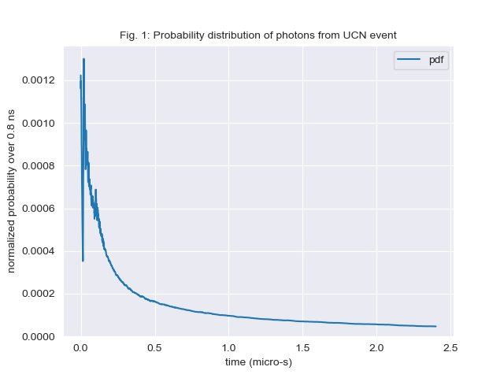
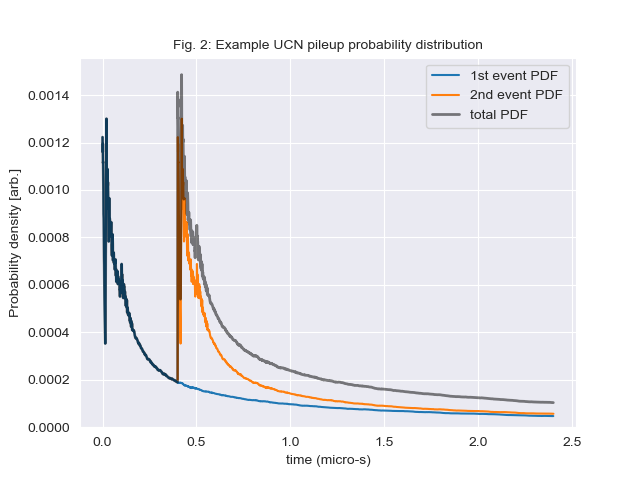

# pulseTrain

- [pulseTrain](#pulsetrain)
  - [Background](#background)
- [Getting started](#getting-started)
  - [Git Bash](#git-bash)
  - [Git LFS](#git-lfs)
  - [Clone this repository](#clone-this-repository)
  - [Conda](#conda)
  - [CUDA install](#cuda-install)
  - [Conda environment](#conda-environment)
- [Scripts](#scripts)
  - [Generate training, test, and validation data](#generate-training-test-and-validation-data)
  - [Training the network](#training-the-network)
- [Model Architecture(s)](#model-architectures)
  - [Input data types](#input-data-types)
  - [Model outputs](#model-outputs)
- [Contributing](#contributing)


## Background

This section provides a general summary for the non-physicist. For an introduction to the UCNτ neutron lifetime experiment, we suggest the thesis by [Gonzalez (2021)](https://www.proquest.com/openview/ceb18242258c5cf4166b8f084297f7c7/1.pdf?pq-origsite=gscholar&cbl=18750&diss=y), _Precision Measurement of the Neutron Lifetime with the UCNτ Experiment_. The goal of this project is to examine applications of computer vision ML models towards counting neutron events in detectors, with the idea of replacing existing moving-window algorithms. The existing moving-window algorithms require more complicated instrumentation (such as additional detectors) and are computationally expensive.

One method of ultracold neutron detection involves capturing a neutron on a material, emitting some photons (i.e. light), and then detecting the photons with a photomultiplier tube (PMT). The probability distribution function (PDF) of photons for a single neutron event can be depicted as in Fig. 1. Typically, there are 30 - 40 photons per neutron event.



A single neutron event is not difficult to count. A naive method would be to bin photon counts and to set a threshold. However, what happens if there are two (or more) neutron events that occur in quick succession? We call this a pileup event, and an example instance PDF is displayed in Fig. 2.



The sparsity of photon counts per neutron event in combination with the long PDF decay "tails" means that it may be easy to miscontstrue multiple events as only one. Miscounts are extremely detrimental to the accuracy of UCNτ, as the aggregation of a handful of miscounts per run easily skew experimental accuracy over the course of a multi-year measurement cycle. Pileup events are further complicated with the influence of background photon counts. For instance, the neutron absorption material glows for a very long time after being activated, and over the course of a neutron counting period the background photon count steadily increases. Other background events are coupled to temperature, ambient light leaks, cosmic rays, or radioactive decays from the experimental area.

# Getting started

Tested on a Windows 10 PC with a 3070TI, Git bash and Conda

## Git Bash

Install the Git Bash utility for Windows from [Git SCM](https://git-scm.com/downloads)

(Useful note on git-credential store methods for Windows [here](https://github.com/git-ecosystem/git-credential-manager/blob/main/docs/credstores.md))

## Git LFS

The coincidences file (`coinc_4200_5441.dat`) is large and requires the use of the Git large file storage (LFS). A commit + push that involves this file counts against the 1 Gb/mo bandwidth in my account. Instructions for installing Git LFS are [here](https://docs.github.com/en/repositories/working-with-files/managing-large-files/installing-git-large-file-storage).

On Ubuntu, the apt-get package manager can install Git LFS. On Windows, the Git Bash install may bundle Git LFS for you. Installation of Git LFS may be verified by running the below command in the `pulseTrain` root directory

```bash
git lfs env
```

## Clone this repository

```bash
git clone https://github.com/dougUCN/pulseTrain.git
```

## Conda

Install Conda following the instructions [here](https://conda.io/projects/conda/en/latest/user-guide/install/index.html)

To get Conda to run on Git Bash, to the `~/.bashrc` configuration file add the line

```bash
source /c/Users/$USERNAME/anaconda3/etc/profile.d/conda.sh
```

with `$USERNAME` replaced appropriately, or the path modified if you chose a different installation directory for conda. Then, restart your Git Bash instance.

## CUDA install

As per Nvidia's [instructions](https://docs.nvidia.com/cuda/cuda-installation-guide-microsoft-windows/index.html), installation of the CUDA Toolkit with Conda simply requires

```bash
conda install cuda -c nvidia
```

Verify the install with `nvcc -V`. The output for my device is

```
nvcc: NVIDIA (R) Cuda compiler driver
Copyright (c) 2005-2023 NVIDIA Corporation
Built on Tue_Jun_13_19:42:34_Pacific_Daylight_Time_2023
Cuda compilation tools, release 12.2, V12.2.91
Build cuda_12.2.r12.2/compiler.32965470_0
```

Uninstall with `conda remove cuda`

## Conda environment

Create a conda environment from the provided `environment.yml` file

```bash
conda env create -f environment.yml
conda activate pulseTrain
```

Other useful conda commands

```bash
conda install PACKAGE_NAME # Install a package
conda deactivate # Exit the environment
conda env list # List all conda environments
conda create --name ENV_NAME # Create a new conda environment carrying over dependencies from base
conda env export > environment.yml # Export active environment to a configuration file
conda remove --name ENV_NAME --all # deletes environment ENV_NAME and uninstalls associated packages
```

# Scripts

## Generate training, test, and validation data

```
$ python generate_training_data.py --help
usage: generate_training_data.py [-h] [-l LENGTH] [-sb STARTBUFFER] [-eb ENDBUFFER] [-ucn UCN UCN] [-p PHOTONS PHOTONS]

Generate training, validation, and test data sets via Monte Carlo

options:
  -h, --help            show this help message and exit
  -l LENGTH, --length LENGTH
                        Number of bins in the pileup window. [1 bin = 1 ns] (default: 2000)
  -sb STARTBUFFER, --startBuffer STARTBUFFER
                        Allows UCN events to occur before the pileup window by some number of bins [1 bin = 1 ns]
                        (default: 50)
  -eb ENDBUFFER, --endBuffer ENDBUFFER
                        Does NOT allow UCN events to occur before the end of the pileup window by some number of bins [1   
                        bin = 1 ns] (default: 25)
  -ucn UCN UCN, --ucn UCN UCN
                        [min, max] number of allowed UCN events per dataset (default: [0, 50])
  -p PHOTONS PHOTONS, --photons PHOTONS PHOTONS
                        [av, std_dev] Gaussian dist. of photons (integer) to generate per UCN event (default: [35, 2.5])
```

## Training the network

```
$ python train_model.py --help
usage: train_model.py [-h] [-f FILENAME] [--showModelOnly]

Train model

options:
  -h, --help            show this help message and exit
  -f FILENAME, --filename FILENAME
                        metadata filename (default: in/metadata.csv)
  --showModelOnly       Exit immediately after displaying model params (default: False)
```

# Model Architecture(s)

This section will be updated with candidate models as they are implemented and evaluated

**Multi Scale 1D ResNet by Fei Wang**


https://github.com/geekfeiw/Multi-Scale-1D-ResNet/tree/master

```
@article{wang2018csi,
title={CSI-Net: Unified Body Characterization and Action Recognition},
author={Wang, Fei and Han, Jinsong and Zhang, Shiyuan and He, Xu and Huang, Dong},
journal={arXiv preprint arXiv:1810.03064},
year={2018}
}
```

## Input data types

## Model outputs

# Contributing

For additional documentation and contribution guidelines see [CONTRIBUTING.md](CONTRIBUTING.md)
